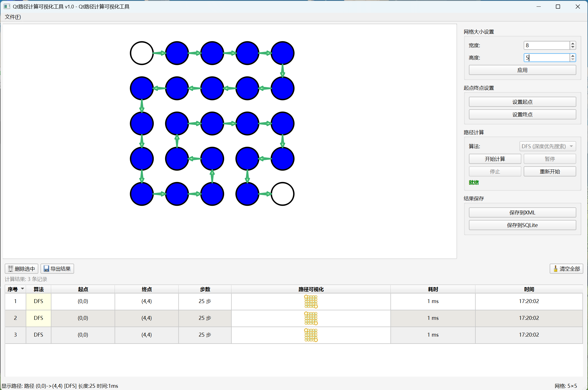

# QWeight Demo - Qt路径计算可视化工具



## 项目简介

QWeight Demo 是一个基于Qt框架开发的路径计算可视化工具，提供了直观的网格界面用于路径搜索算法的演示和分析。该项目支持深度优先搜索(DFS)算法，并提供了完整的数据持久化功能。

## 主要特性

### 🎯 核心功能
- **可视化网格界面**: 直观的矩形网格显示，支持动态调整网格大小
- **路径计算算法**: 实现深度优先搜索(DFS)算法进行路径查找
- **美化箭头显示**: 采用一笔画风格的精美箭头，直观展示路径方向
- **实时路径预览**: 鼠标操作实时显示路径规划结果
- **批量路径计算**: 支持多起点终点的批量路径计算

### 💾 数据管理
- **多格式支持**: 支持XML、SQLite、CSV三种数据格式
- **自动数据持久化**: 计算结果自动保存，支持历史记录管理
- **智能文件检测**: 自动识别文件格式并加载数据
- **选择性导出**: 支持选中特定结果进行导出操作

### 🎨 用户界面
- **现代化设计**: 清晰的布局和直观的操作界面
- **路径可视化表格**: 在结果列表中直接显示路径的视觉化预览
- **颜色编码**: 使用浅绿色箭头和淡黄色节点提供最佳视觉体验
- **响应式布局**: 支持窗口大小调整，自适应显示

## 技术架构

### 开发环境
- **框架**: Qt 6.x
- **语言**: C++14
- **构建工具**: qmake / CMake
- **编译器**: 支持MSVC、MinGW、GCC

### 核心组件
```
src/
├── main.cpp                 # 程序入口
├── MainWindow.*             # 主窗口管理
├── GridGraphicsView.*       # 网格视图组件
├── ControlPanel.*           # 控制面板
├── ResultListWidget.*       # 结果列表展示
├── PathCalculator.*         # 路径计算算法
├── ArrowRenderer.*          # 美化箭头渲染器
├── ArrowGraphicsItem.*      # 箭头图形项
├── PathVisualWidget.*       # 路径可视化组件
├── DataManager.*            # 数据管理器
├── HistoryManager.*         # 历史记录管理
├── PathResult.*             # 路径结果数据结构
├── GridPoint.*              # 网格点数据结构
└── Common.h                 # 公共定义
```

## 快速开始

### 编译要求
- Qt 6.0 或更高版本
- C++14 支持的编译器
- CMake 3.16+ 或 qmake

### 编译步骤

#### 使用 qmake
```bash
cd QWeight_demo
qmake QWeight_demo.pro
make
```

#### 使用 CMake
```bash
cd QWeight_demo
mkdir build && cd build
cmake ..
make
```

### 运行程序
```bash
# Windows
./QWeight_demo.exe

# Linux/macOS
./QWeight_demo
```

## 使用指南

### 基本操作
1. **设置网格**: 在控制面板中调整网格大小(宽度×高度)
2. **设置起点**: 在网格中左键点击设置起始点(绿色圆圈)
3. **设置终点**: 在网格中右键点击设置目标点(红色圆圈)
4. **开始计算**: 点击"开始计算"按钮执行路径搜索
5. **查看结果**: 在下方结果列表中查看计算结果和路径可视化

### 高级功能
- **批量计算**: 设置多个起点终点进行批量路径计算
- **数据保存**: 使用右上角的保存按钮将结果保存为XML或SQLite格式
- **数据加载**: 通过文件菜单加载之前保存的计算结果
- **结果导出**: 选中特定结果后导出为CSV格式

### 快捷键
- `Ctrl+O`: 打开数据文件
- `Ctrl+S`: 保存当前结果
- `Ctrl+N`: 清空当前网格
- `F5`: 重新计算路径

## 数据格式

### XML格式示例
```xml
<?xml version="1.0" encoding="UTF-8"?>
<PathResults>
    <Result>
        <StartPoint x="0" y="0"/>
        <EndPoint x="5" y="5"/>
        <PathLength>10</PathLength>
        <CalculationTime>15</CalculationTime>
        <Path>
            <Point x="0" y="0"/>
            <Point x="1" y="0"/>
            <!-- 更多路径点 -->
        </Path>
    </Result>
</PathResults>
```

### SQLite数据库结构
- `path_results`: 主结果表
- `path_points`: 路径点详细信息表

## 算法说明

### 深度优先搜索 (DFS)
项目实现了经典的深度优先搜索算法用于路径查找：

- **时间复杂度**: O(V + E)，其中V是顶点数，E是边数
- **空间复杂度**: O(V)
- **特点**: 能够找到从起点到终点的路径，但不保证是最短路径
- **适用场景**: 适合探索所有可能路径或在稠密图中快速找到解

## 项目特色

### 🎨 美化箭头渲染
- 采用参考专业图形库的箭头算法
- 实现一笔画风格的流畅箭头
- 箭头宽度为两点距离的1/7，视觉效果最佳
- 支持抗锯齿渲染，显示效果平滑

### 📊 智能数据管理
- 自动检测并适配多种数据格式
- 支持增量数据保存和加载
- 提供数据完整性验证
- 智能的矩阵大小恢复功能

### 🔧 高性能计算
- 100ms定时器批处理优化
- 内存友好的数据结构设计
- 异步计算避免界面阻塞
- 智能的结果缓存机制

## 版本历史

### v1.0.0 (最新版本)
- ✅ 完整的路径计算功能
- ✅ 美化的箭头显示效果
- ✅ 多格式数据持久化
- ✅ 响应式用户界面
- ✅ 批量计算和选择性导出

## 贡献指南

欢迎提交Issue和Pull Request来帮助改进项目！

### 开发环境设置
1. 克隆仓库: `git clone https://github.com/caixuf/QWeight_demo.git`
2. 安装Qt开发环境
3. 配置编译环境
4. 运行测试确保功能正常

### 提交规范
- 遵循现有的代码风格
- 添加适当的注释和文档
- 确保新功能有相应的测试
- 提交前运行完整的编译测试

## 许可证

本项目采用MIT许可证，详见 [LICENSE](LICENSE) 文件。

## 作者

- **caixuf** - 项目创建者和主要维护者

## 致谢

- Qt框架提供的强大GUI支持
- 参考了专业图形库中的箭头渲染算法
- 感谢所有贡献者的支持和建议

---

**如果这个项目对您有帮助，请给它一个⭐️！**
